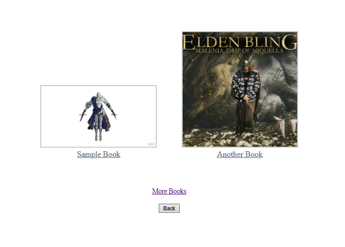
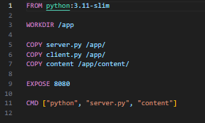
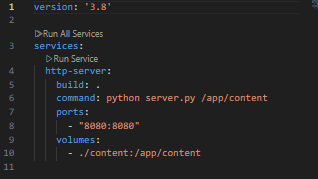
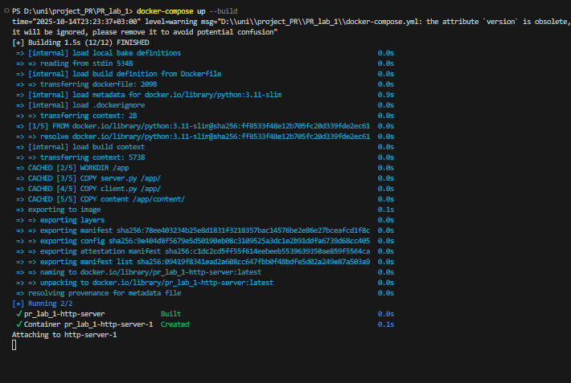

# PR Lab 1: HTTP File Server with TCP Sockets

### Author: Bujor-Cobili Alexandra

## 1. Source Directory Structure


The root directory contains server.py, client.py, Dockerfile, etc.

## 2. Served Directory Contents


The content directory includes index.html, sample files. books/ subdirectory with three PDF files, and docs/ subdirectory with PNG files. File bling.jpg is present but returns 404 due to .jpg extension not being supported.

## 3. Client Implementation


The HTTP client can be tested with: 

```bash
python client.py localhost 8080 /sample.pdf downloads/
```
This downloads the PDF to the downloads/ directory.

 

## 4. Directory Listing

 
 Browser showing /books/ directory listing with clickable files
  
Main Page, clicking a file serves the PDF directly.

## 5. Docker Configuration Files


Dockerfile contents



 docker-compose.yml contents

Dockerfile uses Python 3.11-slim base image, copies server.py, client.py, and content. docker-compose.yml defines http-server service with port mapping 8080:8080 and volume mount for live content updates.

## 6. Starting the Container


docker-compose up command and output

Server runs on http://localhost:8080.

## 7. Browser Requests for 4 File Types

### Inexistent File (404)


Accessing http://localhost:8080/nonexistent.pdf displays a styled 404 page with large "404" text and the requested path.

### HTML File with Embedded Image


http://localhost:8080/index.html renders the HTML page with `` displaying the PNG image inline.

### PNG Image


http://localhost:8080/docs/l2_hk.png displays the PNG image directly in the browser.

### PDF from Subdirectory


Accessing http://localhost:8080/books/book2.pdf serves a PDF from a nested directory.


## 8. Network Setup for Friend's Server
During demo, I located friend's IP address using `ipconfig` or `ifconfig`, connected to their server IP on port 8080. 


I viewed their directory listings and downloaded files using my client: `python client.py <supposed_ip> 8080 /asd.pdf downloads/`.*

I swear it worked.