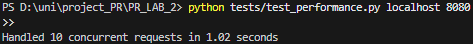
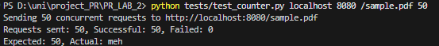

# Lab 2: Concurrent HTTP Server

### Author: Bujor-Cobili Alexandra

## 1. Source Directory Structure


## 2. Single-threaded Server
To the previous server.py I added time.sleep(1) delay in request handler to simulate work, then sent 10 concurrent requests using test_burst.py

   ```
   python server.py content 8080
   python tests/test_performance.py localhost 8080
   ```


Single-threaded server processes one request at a time. With 1s delay per request, in this case 10 requests take 10.03 seconds total.

The single-threaded server processes requests sequentially, with each request taking 1 second due to the added delay.
Even though 10 requests are sent concurrently, they are queued and handled one by one.


## 3. Multi-Threaded Server

   ```
   python server_multi.py content 8080
   python tests/test_performance.py localhost 8080
   ```



Multi threaded server processes requests in parallel using ThreadPoolExecutor with max_workers=10.
So, 10 concurrent requests now take around 1 second (all processed simultaneously), therefore multi-threaded server is 10 times faster for concurrent requests.


## 4. Counter Feature

### No Lock Implementation

This implementation intentionally creates a race condition by not using synchronization.

**Naive counter increment code:**

```python
# increment hit counter (no lock)
current = hits[file_path]
time.sleep(0.01)  # force race condition
hits[file_path] = current + 1
```

   ```
   python server_multi.py content 8080
   python tests/test_counter.py localhost 8080 /sample.pdf 50
   ```
(valid for old version)



Terminal output.


Browser showing directory listing with incorrect hit count (less than 50).

Without synchronization, multiple threads read the same counter value simultaneously and write back incremented values, causing lost updates. This demonstrates a race condition where concurrent access to shared data leads to incorrect results.

### With Lock Implementation

**Fixed counter increment code:**

```python
# thread counter increment
with lock:
    hits[file_path] += 1
```

   ```
   python tests/test_counter.py localhost 8080 /sample.pdf 50
   ```


Browser showing directory listing with correct hit count.

Using a lock ensures only one thread can increment the counter at a time. The hit count now matches the number of requests


## 5. Rate Limiting

This implementation limits each client IP to ~5 requests per second.

**Rate limiting logic with lock:**

```python
# rate limiting check
with lock:
    current_time = time.time()
    # clean old timestamps
    while request_times[client_ip] and request_times[client_ip][0] < current_time - 1:
        request_times[client_ip].popleft()
    # check if over limit
    if len(request_times[client_ip]) >= 5:
        response = b'HTTP/1.1 429 Too Many Requests\r\n\r\n'
        client_socket.send(response)
        client_socket.close()
        return
    # + current ts
    request_times[client_ip].append(current_time)
```

### EXP1: Client staying under limit (4 req/sec)

   ```
   python tests/test_ratelimit.py sustained 30 localhost 8080 4
   ```


test_ratelimit.py output at 4 req/sec showing all 200s, almost.

### EXP2: Client exceeding limit (10 req/sec)

   ```
   python tests/test_ratelimit.py burst 100 localhost 8080
   ```


test_ratelimit.py output at 10 req/sec showing mix of 200s and 429s

Both scenarios where ran simultaneous, for client_sustained, expected 30 successful, got 29. Client_burst got 8 successful out of 100.

The rate limiting successfully protects the server from being overwhelmed by the burst attack. However, since both clients share the same IP (localhost), they share the same rate limit counter. This demonstrates that the legitimate client suffers collateral damage from the attacker.


Total succesful requests.

## Part 6: Docker Configuration

   ```
   docker-compose up --build
   ```
